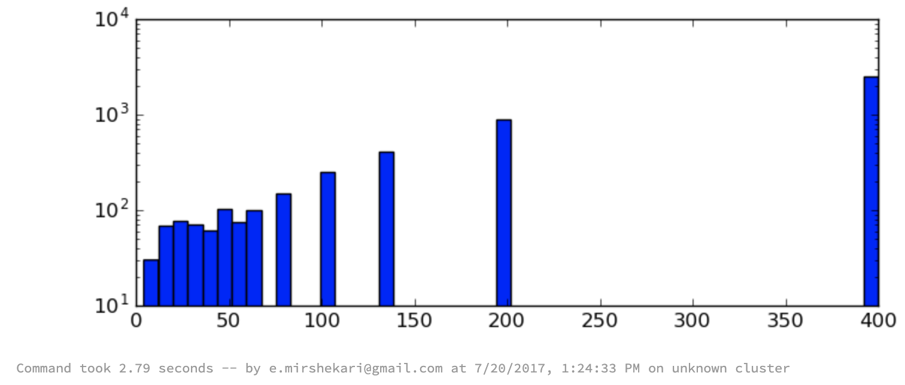

In this repo there are my pyspark (Spark in Python language) machine learning projects that I did in big data Hackathon. (https://hackondata.devpost.com/)
The list of the projects are as follows:

**1- entity_resolution.py**

**2- log_analysis.py**

**3- Predicting Movie Ratings**

**4-  Linear Regression**

**5- Principal Component Analysis**

